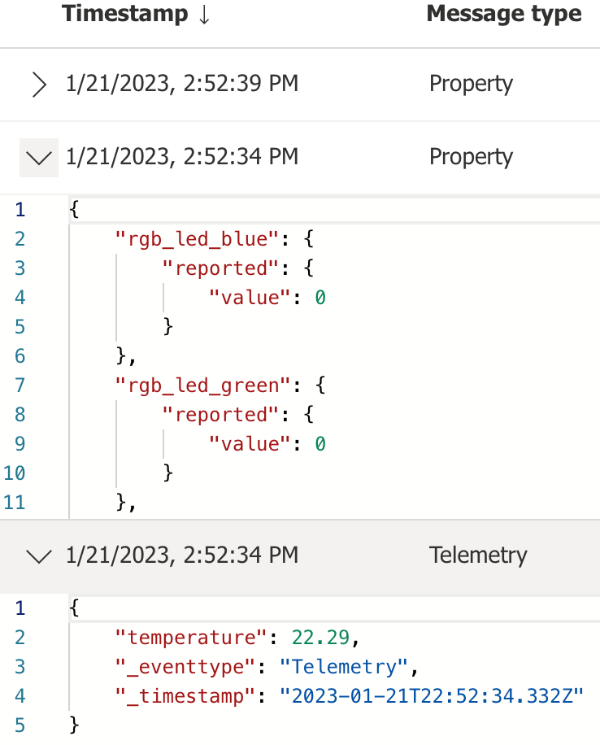

# Deep Dive Review for AnyCloud Python Script Operations

The script will first check to see if you are currently connected to a WiFi network. If you are not connected, it will issue commands to connect with an Access Point using the SSID and passphrase settings.

    --------------------------------------------------------------------------------
    Starting the AnyCloud Azure IoT Central Demonstration
    --------------------------------------------------------------------------------

    Press ESC to Exit the script

    Start Initialization...
    .............................
    ATE1
    OK
    >
    AT+WSTA
    +WSTA:0
    OK
    >
    Event: WiFi not connected, initialializing
    AT+WSTAC=1,"your_SSID"
    OK
    >
    AT+WSTAC=2,3
    OK
    >
    AT+WSTAC=3,"your_PASSPHRASE"
    OK
    >
    AT+WSTAC=4,255
    OK
    >
    AT+WSTAC=12,"pool.ntp.org"
    OK
    >
    AT+WSTAC=13,1
    OK
    >
    AT+WSTA=1
    OK
    >
    +WSTALU:"5C:76:95:1B:D9:2F",6
    >
    +WSTAAIP:"10.0.0.156"
    >
    Event: WiFi connected

It will then check if you are already connected to an MQTT broker.  If not, it will issue the commands to connect to the Azure DPS server. The DPS server uses a common host address to handle all requests. The unique device ID entered into the top of the script is used for the MQTT Client ID (MQTTC=3), and it is also part of the user name parameter (MQTTC=4). The ID Scope identifies your application which is also part of the username field.

    AT+MQTTCONN
    +MQTTCONN:0
    OK
    >
    Broker disconnected....

    AT+MQTTC=1,"global.azure-devices-provisioning.net
    OK
    >
    AT+MQTTC=2,8883
    OK
    >
    AT+MQTTC=3,"your_DEVICE_ID"
    OK
    >
    AT+MQTTC=4,"your_ID_SCOPE/registrations/your_DEVICE_ID/api-version=2019-03-31"
    OK
    >
    AT+MQTTC=7,1
    OK
    >
    AT+MQTTCONN=1
    OK
    >
    +MQTTCONNACK:0,0
    >
    +MQTTCONN:1
    >
    Event: MQTT broker connected

    Event: DPS subscription received notification
Finally, the script subscribes to the DPS MQTT notification topic, and publishes to a topic that registers the device.  The initial publish to the registration topic includes the model ID as the payload.  The result of this publication will be a JSON message with an "operationID" field, and the status "assigning".  The code then delays 3 seconds, and issues a polling request to a second topic to determine if the registration is complete.  If the status is still "assigning", it will continue to delay 3 seconds and poll the registration status until the response status is "assigned".  Once the status is "assigned", the response will include a "assignedHub" key, with the host name corresponding to the IoT Hub which is used by the Azure IoT Central application.

    subscribe to DPS result topic
    AT+MQTTSUB="$dps/registrations/res/#",0
    OK
    >
    +MQTTSUB:0
    >

    Event: Subscribed to DPS topics, publish registration request....

    publish DPS registration message
    AT+MQTTPUB=0,0,0,"$dps/registrations/PUT/iotdps-register/?rid=1","{\"payload\" : {\"modelId\" : \"dtmi:com:Microchip:WBZ451_Curiosity;1\"}}"
    OK
    >
    +MQTTPUB:47,"$dps/registrations/res/202/?$rid=&retry-after=3",94,"{"operationId":"4.65f62b2644c85bb1.331ffb1b-35e2-4b5a-9e68-f1fa7d5efc33","status":"assigning"}"
    >
    Event: DPS subscription received notification
    --------------------------------
    subscription topic received
      "$dps/registrations/res/202/?$rid=&retry-after=3"
    subcription payload received
    {
        "operationId": "4.65f62b2644c85bb1.331ffb1b-35e2-4b5a-9e68-f1fa7d5efc33",
        "status": "assigning"
    }
    --------------------------------
    AT+MQTTPUB=0,0,0,"$dps/registrations/GET/iotdps-get-operationstatus/?$rid=2&operationId=4.65f62b2644c85bb1.331ffb1b-35e2-4b5a-9e68-f1fa7d5efc33",""
    OK
    >
    +MQTTPUB:48,"$dps/registrations/res/202/?$rid=2&retry-after=3",177,"{"operationId":"4.65f62b2644c85bb1.331ffb1b-35e2-4b5a-9e68-f1fa7d5efc33","status":"assigning","registrationState":{"registrationId":"sn0123FE0CF960432D01","status":"assigning"}}"
    >
    Event: DPS subscription received notification
    --------------------------------
    subscription topic received
      "$dps/registrations/res/202/?$rid=2&retry-after=3"
    subcription payload received
    {
        "operationId": "4.65f62b2644c85bb1.331ffb1b-35e2-4b5a-9e68-f1fa7d5efc33",
        "status": "assigning",
        "registrationState": {
            "registrationId": "sn0123FE0CF960432D01",
            "status": "assigning"
        }
    }
    Event: DPS subscription received notification
    --------------------------------
    subscription topic received
      "$dps/registrations/res/200/?$rid=3"
    subcription payload received
    {
        "operationId": "4.65f62b2644c85bb1.331ffb1b-35e2-4b5a-9e68-f1fa7d5efc33",
        "status": "assigned",
        "registrationState": {
            "x509": {
                "enrollmentGroupId": "dac6db18-b4fb-48ed-b79a-c9f9954956a9"
            },
            "registrationId": "sn0123FE0CF960432D01",
            "createdDateTimeUtc": "2023-01-10T21:52:50.5898405Z",
            "assignedHub": "iotc-524cd5bf-f583-46a6-9ac4-873783da764e.azure-devices.net",
            "deviceId": "sn0123FE0CF960432D01",
            "status": "assigned",
            "substatus": "initialAssignment",
            "lastUpdatedDateTimeUtc": "2023-01-10T21:52:52.1928267Z",
            "etag": "IjYyMDI0NGRkLTAwMDAtMDcwMC0wMDAwLTYzYmRkZTM0MDAwMCI="
        }
    }
    --------------------------------

At this point, the DPS process has completed.  The application will disconnect from the DPS server.  

**Note:** AnyCloud™ does not support simultaneous connections to multiple MQTT brokers, so the disconnect step is required.

    Registration complete, connect to Azure IoT Central

    AT+MQTTDISCONN
    OK
    >
    +MQTTCONN:0
    >

The application is now ready to connect to IoT Central.  The script will set up the MQTT client with new connection information.  This includes using the host name (`assignedHub`) received from DPS as the MQTT server name.  The clientID remains the `deviceId`.  The user name is updated to a new format:

MQTT client user name = <`IOTC host name from DPS`>/<`deviceId`>/?`api-version=2021-04-12"`

**Note** The Azure IoT Central documentation will indicate the `api-version` above is recommended but optional, but some behaviors demonstrated later in this script will not work if the `api-version` field is ommitted.

The commands executed to connect to IoT Central follow below.  

    AT+MQTTC=1,"your_HOST_NAME_ID_FROM_DPS"
    OK
    >
    AT+MQTTC=2,8883
    OK
    >
    AT+MQTTC=3,"your_DEVICE_ID"
    OK
    >
    AT+MQTTC=4,"your_HOST_NAME_ID_FROM_DPS/your_DEVICE_ID/?api-version=2021-04-12"
    OK
    >
    AT+MQTTC=7,1
    OK
    >
    AT+MQTTCONN=1
    OK
    >
    +MQTTCONNACK:0,0
    >
    +MQTTCONN:1
    >

After the connection is completed, the next behavior is subscribing to the three topics are used by Azure IoT Central to communicate with devices.  The first topic receives commands from IoT Central.  The second is notified when you request the device twin status.  The final topic is used for property updates.

    AT+MQTTSUB="$iothub/methods/POST/#",1
    OK
    >
    +MQTTSUB:0
    >
    AT+MQTTSUB="$iothub/twin/res/#",1
    OK
    >
    +MQTTSUB:0
    >
    AT+MQTTSUB="$iothub/twin/PATCH/properties/desired/#",1
    OK
    >
    +MQTTSUB:0
    >

Once the topics have been subcribed to, the script requests the current status of the device twin from IoT Central by publishing to the `$iothub/twin/GET/` topic.  That is met by a response that is every property that has been previously writen by the device, including parameters updated during previous connections.  The script prints out a "pretty" version of the JSON object received, and grabs the telemetry interval, which will be adopted as the rate periodic telemetry is sent to IOTC later on.

    Read current device twin settings from IOTC

    AT+MQTTPUB=0,0,0,"$iothub/twin/GET/?$rid=4",""
    OK
    >
    +MQTTPUB:28,"$iothub/twin/res/200/?$rid=4",517,"{"desired":{"telemetryInterval":5,"rgb_led_blue":0,"rgb_led_green":0,"rgb_led_red":0,"led_user":3,"$version":101},"reported":{"telemetryInterval":{"ac":200,"av":101,"ad":"telemetryInterval set to: 5","value":5},"rgb_led_blue":{"ac":200,"av":95,"ad":"rgb_led_blue set to: 0","value":7},"rgb_led_green":{"ac":200,"av":96,"ad":"rgb_led_green set to: 0","value":0},rgb_led_red":{"ac":200,"av":100,"ad":"rgb_led_red to: 0","value":0},"led_user":{"ac":200,"av":95,"ad":"led_user set to: 3","value":3},"$version":145}}"
    >
    --------------------------------
    subscription topic received
      "$iothub/twin/res/200/?$rid=4"
    subcription payload received
    {
        "desired": {
            "telemetryInterval": 5,
            "rgb_led_blue": 0,
            "rgb_led_green": 0,
            "rgb_led_red": 0,
            "led_user": 3,
            "$version": 101
        },
        "reported": {
            "telemetryInterval": {
                "ac": 200,
                "av": 101,
                "ad": "telemetryInterval set to: 5",
                "value": 5
            },
            "rgb_led_blue": {
                "ac": 200,
                "av": 95,
                "ad": "rgb_led_blue set to: 0",
                "value": 0
            },
            "rgb_led_green": {
                "ac": 200,
                "av": 96,
                "ad": "rgb_led_green set to: 0",
                "value": 0
            },
            "rgb_led_red": {
                "ac": 200,
                "av": 100,
                "ad": "rgb_led_red set to: 0",
                "value": 0
            },
            "led_user": {
                "ac": 200,
                "av": 95,
                "ad": "led_user set to: 3",
                "value": 3
            },
        "$version": 145
        }
    }
    --------------------------------
    telemetryInterval set to 5 based on Device Twin State    
    
    Sending Telemetry and Properties.
        Press ESC to end script

If you login to your application on IoT Central, it is now possible to see how the script is interacting with the IoT Central application.

Start by looking at the devices registered to the application.  Click **Devices** on the left naviagation pane, and note that the device shows up with the Common Name (CN) from the X.509 certifcate as its *Device ID*.  Also note the *Device Template* selected is now `WBZ451_Curiosity;1`. This device template was configured during the connection to the Device Provisioning Service because it is published in the [IoT Plug and Play Models Repository](https://github.com/Azure/iot-plugandplay-models).

If you click the device name shown on the devices screen, IoT Central will show you are currently connected. You will also have the ability to click on a selection of device views that allow you to inspect the device state and data from recent transactions; the **Raw data** view is typically the most convenient place to see all incoming & outgoing messages.

Scrolling down to the first two transactions sent after the connection to IoT Central was established, you can expand them to see the values written by the script.

After these initial values are sent, the script begins publishing spoofed temperature sensor telemetry at the "telemetryInterval" rate.  The telemetry interval defaults to 10 seconds, but this is a writeable property that can be updated from IoT Central.

[Click here](./DeviceTemplate_CreatingViews.md) to create a "Properties" view that allows you to change any of the Cloud-writable properties. Once this new view has been added to the device template, click on the Properties view and type in a new value for the Telemetry Interval. Click on the **Save** icon to send the property update request to the physical device. You should see the status of the property listed as "Pending" until a confirmation has been received from the physical device that the property was successfully updated. At this point in time, the status of the property should revert back to the "Accepted" state.

IoT Central will publish a message to the property PATCH topic.  The message will contain the new telemetry interval value, as well as a version field.

    property updated from IoT Central
    -------------------------------
    subscription topic received
      "$iothub/twin/PATCH/properties/desired/?$version=105"
    subcription payload received
    {
        "telemetryInterval": 5,
        "$version": 105
    }
    --------------------------------
    $version = 105
    telemetryInterval set to: 5

    Temperature sensor telemetry updating at the new telemetry interval
    Check Raw Data tab to verify

The Plug-n-Play standard requries acknowledging these messages.  The AnyCloud™ response payload is shown below.

    AT+MQTTPUB=0,0,0,"$iothub/twin/PATCH/properties/reported/?rid=8","{\"telemetryInterval\" : {\"ac\" : 200, \"av\" : 105, \"ad\" : \"telemetryInterval set to: 5\", \"value\" : 5}}"
    OK
    > 
A "pretty" version of the response payload follows for ease of readability

    {
        "telemetryInterval": {
            "ac": 200,
            "av": 105,
            "ad": "telemetryInterval set to: 5",
            "value": 5
        }
    }

There are several things to note in the response.  The response to a writeable property must be in a specific format.  It includes an acknowledge code ("ac"), which is essentially an HTTP status code (the most common being 200 for OK).  Other codes are available to indicate problematic/error states. The version number received with the telemetry interval is a value used to serialize and track the requests.  The version received in the write request must be returned in the acknowledge version ("av") field of the response; "ad" is an optional string that can be included for a descriptive text, and the last field returned is the updated value for the received property.

Depending how quickly the write propery response is received, it is possible that IoT Central will show the value as "pending". If the device is offline or doesn't respond to writeable property request, the value can display as pending indefinitely in IoT Central until a valid property update acknowledge has been received.

The last item the script demonstrates is receiving Cloud to Device (C2D) commands, which are referred to as "methods" in the IoT Central documentation.  To send a method request to the embedded device, IoT Central publishes to the methods POST topic, with the command name included in the topic path.  In the example below, the method name is "reboot".

    $iothub/methods/POST/reboot/

This can be demonstrated directly from IoT Central on the device's **Commands** tab.

"PT5S" is an [ISO 8601](https://en.wikipedia.org/wiki/ISO_8601) period designator, which decodes to 5 seconds following the standard's definition.  The script only supports periods in seconds, but the standard covers durations years, months, days, etc.

    'P'eriod 
    'T'ime 
     5
    'S'econds

After you enter a valid field, the **Run** button can be pressed.

IoT Central will publish to the topic described above with the payload defined in the device twin.  The script parses the command name out of the topic, decodes the delay value in the published payload, and prints the command to be executed.  The python script does reboot the PC, but if you were to run this exercise on a WBZ451 Curiosity Board, the board would be reset within 5 seconds after receiving the command.

    +MQTTPUB:35,"$iothub/methods/POST/reboot/?$rid=1",16,"{"delay":"PT5S"}"
    >
    received command from IoT Central
    --------------------------------
    subscription topic received
      "$iothub/methods/POST/reboot/?$rid=1"
    subcription payload received
    {
        "delay": "PT5S"
    }
    --------------------------------

    execute reboot(5)

When the `WBZ451_Curiosity;1` device twin model interface (DTMI) was originally defined, part of that definition included a response packet for the command.  The device twin structure can be viewed in IoT Central, by selecting "Device Templates" using the left-hand side navigation pane, then the name and version of the device template being used.

When the device template opens, expand the reboot command with the drop down control.  

Notice the command is enabled, and a response is expected.  There are also two objects being defined: one for the command payload, and one for the response payload. Click the Define button for the response payload, to view the object that is expected to be returned by the embedded device when the reboot command is received. 

From here, notice two items are expected in the response payload, a "status" string, and a "delay" integer, that should match the reboot delay.  

Two other things are dictated by the IoT Plug-and-Play method response standard.  The response topic published to, includes an status code in the path of the topic, and the the rid value received with the method request.  

The response code is typically 200 for OK, and the request ID value is handled much like the version field of property write responses. So the response topic follows this pattern: "$iothub/methods/res/`response_code`/?$rid=`request_ID`"

Putting it all together for for the example reboot command received above, the response published has the following topic and payload:

    AT+MQTTPUB=0,0,0,"$iothub/methods/res/200/?$rid=1","{\"status\" : \"Success\", \"delay\" : 5}"
    OK
    >

