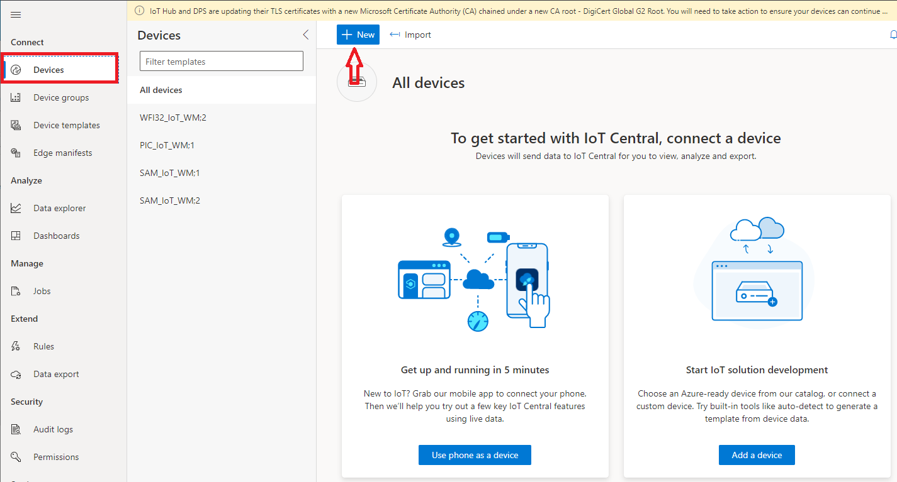
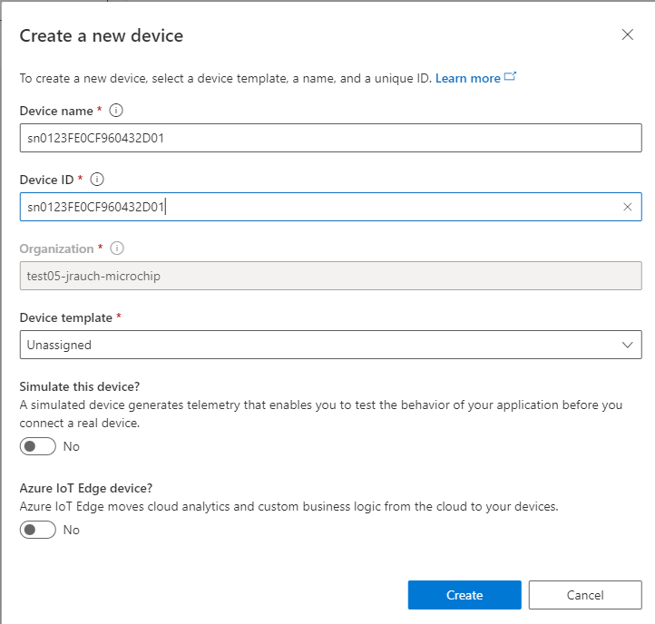
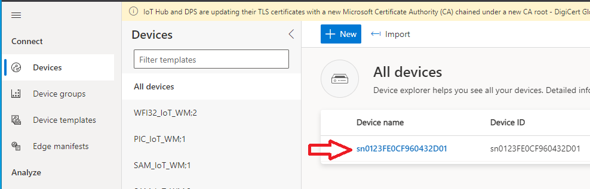
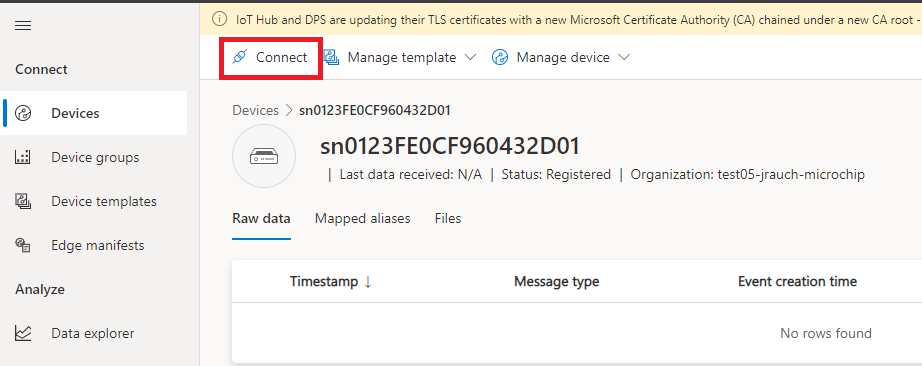
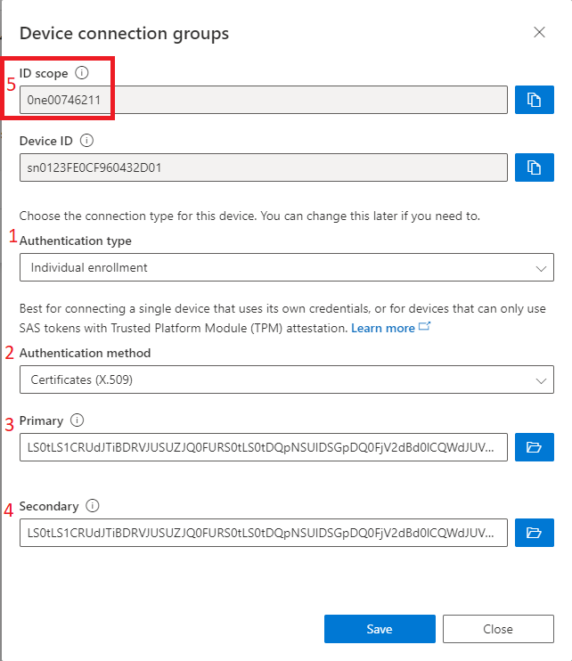

# Azure IoT Central AnyCloud Python Demo

## Introduction
Anycloud is firmware package for Microchips WFI32 module that runs on the [WFI32 Curiosity](https://www.microchip.com/en-us/development-tool/EV12F11A) board or the [WFI32-IoT](https://www.microchip.com/en-us/development-tool/ev36w50a) board.  The AnyCloud project includes firmware to enable modifications, or a binary image that can be programmed directly.  It is available on Microchip's corporate github account.  To review software or download as a zip file, visit the [AnyCloud](https://github.com/MicrochipTech/PIC32MZW1_AnyCloud) project.

## Prerequisite Software / Tools Installation
For those using pre-built binary file for the WFI32 board, install

* git
* Python 3
* Pyserial
* OpenSSL (or similar tool to parse the device certificate file)

## Getting Started

### Step 1 - Install AnyCloud on your WFI32-IoT or WFI32 Curiosity Board
Instructions are available in the [AnyCloud README](https://github.com/MicrochipTech/PIC32MZW1_AnyCloud/blob/main/README.md) file.

Recommendations:

Clone the project to your local machine, even if you are not planning to build it initially.  This provides a local copy of the README file, you can review project source code to self-support, and it includes the pre-built hex file that can be programmed without re-building if that is your wish. 

    git clone https://github.com/MicrochipTech/PIC32MZW1_AnyCloud

**Note** To execute AT commands from a terminal to learn the AnyCloud software, make sure the terminal application has the capability to append '\r\n' (Carriage Return + Line Feed) to the commands you are executing.  The AT commands are not executed without the '\r\n' terminating characters.  

### Step 2 - Read the device certificate from the module

This certificate file will be needed when we create the device in Azure IoT Central

#### 2.1 The device certificate is read using the the following AT command:

    AT+READCERT=1

#### 2.2 Copy AT-READCERT output to a text editor, and save the certificate as a PEM file
Example output from the AT+READCERT=1 command is below.

    +READCERT:1, 794,"-----BEGIN CERTIFICATE-----\nMIICHjCCAcWgAwIBAgIQWOZgk1Ppe0V5JRXGfs9JQTAKBggqhkjOPQQDAjBPMSEw\nHwYDVQQKDBhNaWNyb2NoaXAgVGVjaG5vbG9neSBJbmMxKjAoBgNVBAMMIUNyeXB0\nbyBBdXRoZW50aWNhdGlvbiBTaWduZXIgMkM2MDAgFw0yMDExMTEwNzAwMDBaGA8y\nMDQ4MTExMTA3MDAwMFowQjEhMB8GA1UECgwYTWljcm9jaGlwIFRlY2hub2xvZ3kg\nSW5jMR0wGwYDVQQDDBRzbjAxMjNGRTBDRjk2MDQzMkQwMTBZMBMGByqGSM49AgEG\nCCqGSM49AwEHA0IABFitivHZncd/TZI9DehJi0zo6mCBzuAOpqdoP+DeljIDHLZk\nNsJ8KkGE/LpT9LRf8S9uni2yh063As5UffoIeOWjgY0wgYowKgYDVR0RBCMwIaQf\nMB0xGzAZBgNVBAUTEmV1aTQ4X0U4RUIxQjIwNDVEMjAMBgNVHRMBAf8EAjAAMA4G\nA1UdDwEB/wQEAwIDiDAdBgNVHQ4EFgQUnNLVE1hJtf3x5HdI10xzvQQ6Z9YwHwYD\nVR0jBBgwFoAUy/wEPA2LnSAv7coGgreLjBgnVTQwCgYIKoZIzj0EAwIDRwAwRAIg\nfnI7XNwp9/BE2sqHwFuTGrdQzggqyqV1H9mubBJM1pQCIE4r+I3kq/o5uJ4O1nO8\naE8QzYQ/jXDo2aJXjTdvmc9d\n-----END CERTIFICATE-----\n"

The output includes the AT command's formatting as well as line feeds '\n' that need to be removed.  Copy the output to a text editor, and modify the output so it is a properly formatted PEM file.  Save the file with a name of your choosing, with a PEM extenstion.  For example, you could use the filename *AnyCloud.PEM*.

    -----BEGIN CERTIFICATE-----
    MIICHjCCAcWgAwIBAgIQWOZgk1Ppe0V5JRXGfs9JQTAKBggqhkjOPQQDAjBPMSEw
    HwYDVQQKDBhNaWNyb2NoaXAgVGVjaG5vbG9neSBJbmMxKjAoBgNVBAMMIUNyeXB0
    byBBdXRoZW50aWNhdGlvbiBTaWduZXIgMkM2MDAgFw0yMDExMTEwNzAwMDBaGA8y
    MDQ4MTExMTA3MDAwMFowQjEhMB8GA1UECgwYTWljcm9jaGlwIFRlY2hub2xvZ3kg
    SW5jMR0wGwYDVQQDDBRzbjAxMjNGRTBDRjk2MDQzMkQwMTBZMBMGByqGSM49AgEG
    CCqGSM49AwEHA0IABFitivHZncd/TZI9DehJi0zo6mCBzuAOpqdoP+DeljIDHLZk
    NsJ8KkGE/LpT9LRf8S9uni2yh063As5UffoIeOWjgY0wgYowKgYDVR0RBCMwIaQf
    MB0xGzAZBgNVBAUTEmV1aTQ4X0U4RUIxQjIwNDVEMjAMBgNVHRMBAf8EAjAAMA4G
    A1UdDwEB/wQEAwIDiDAdBgNVHQ4EFgQUnNLVE1hJtf3x5HdI10xzvQQ6Z9YwHwYD
    VR0jBBgwFoAUy/wEPA2LnSAv7coGgreLjBgnVTQwCgYIKoZIzj0EAwIDRwAwRAIg
    fnI7XNwp9/BE2sqHwFuTGrdQzggqyqV1H9mubBJM1pQCIE4r+I3kq/o5uJ4O1nO8
    aE8QzYQ/jXDo2aJXjTdvmc9d
    -----END CERTIFICATE-----

#### 2.3 Use OpenSSL to retrieve the common name used in the certificate
The following OpenSSL command will list certificate details in a easy to read format
    
    openssl x509 -in AnyCloud.PEM -text
The output of the command will show all fields, but the common name is what is required to add a deivce into IoT Central.  That is shown in the *CN* field below. 

    Certificate:
    Data:
        Version: 3 (0x2)
        Serial Number:
            58:e6:60:93:53:e9:7b:45:79:25:15:c6:7e:cf:49:41
        Signature Algorithm: ecdsa-with-SHA256
        Issuer: O = Microchip Technology Inc, CN = Crypto Authentication Signer 2C60
        Validity
            Not Before: Nov 11 07:00:00 2020 GMT
            Not After : Nov 11 07:00:00 2048 GMT
        Subject: O = Microchip Technology Inc, CN = sn0123FE0CF960432D01
        Subject Public Key Info:
            Public Key Algorithm: id-ecPublicKey
                Public-Key: (256 bit)
                pub:
                    04:58:ad:8a:f1:d9:9d:c7:7f:4d:92:3d:0d:e8:49:
                    8b:4c:e8:ea:60:81:ce:e0:0e:a6:a7:68:3f:e0:de:
                    ....

Example: CN = sn0123FE0CF960432D01
### Step 3 - Create an Azure IoT Central Application
If you already have an existing IoT Central Application Created, skip to Step 4.

#### 3.1 Create an Azure Account and Subscription

Microsoft has excellent instructions to create an new Azure account and subscription.  Please create an account and subscription before continuing. Review our overview of the [Azure Account/Subscription creation process](./CreateAzureAccountAndSubscription.md) as required.

#### 3.2 Create an Azure IoT Central Application

Refer to the linked instructions to [create an Azure IoT Central Application](CreateAnAzureIoTCentralApplication.md).

### Step 4 - Create a new device in your Azure IoT Central Application

#### 4.1 Select the Devices menu, and click the "+ New" button

#### 4.2 Use the device certificate common name for the Device ID
*OpenSSL* was used previously to read the certificate common name from the PEM file.  Use the common name for the *Device ID* field. This pairing is how the certificate is matched to the device during registration. The *Device name* can be changed to a friendly name, or left the same as the *Device ID*.

#### 4.2 Select the device, and then click Connect to configure the device authentication method

#### 4.3 Configure an x509 Individual Enrollment
The connect button will open the device connection dialog.  Several items are accomplished here.

1. Select the *Authentication type* as "Individual enrollment"
2. Select the *Authentication method* as "Certifcates (X.509)"
3. Select the file folder icon for the primary certificate, upload your device PEM file.  e.g. *AnyCloud.PEM*
4. Select the file folder icon for the secondary certificate, upload your device PEM file.  e.g. *AnyCloud.PEM*  Both the primary and secondary certificate have to be selected to save the setting.
5. Note the *ID scope* at the top of the dialog.  This is used when we configure the device to connect to Azure.
6. Click the blue *Save* button, then click the *Close* button

Once the device has been configured for the X.509 individual enrollment, it is time to configure the Azure IoT Central Script for your application and device.

### Step 5 - Configuring the AzureAnyCloud.py script

1. Open the AzureAnyCloud.py script in a text editor

2. Enter your WiFi network's SSID and passphrase as the *WiFi Credentials*
3. Enter your Id Scope, and Device ID from the connect dialog (Step 4.2) into the *"*Azure Application/Device Information* settings.
4. Enter the model ID of the device template you wish to interact with in IoT Central.  Example, we can emulate the SAM-IoT Demonstration board from the script using *dtmi:com:Microchip:SAM_IoT_WM;2* as the model ID. 

The model ID will be declared during the DPS registration process.  If the model is published in the Azure's public model repository, IoT Central will download the device model and use it to interact with your device based on the model characteristics.  You can create a  ustom device template in your IoT Central application, which will generate a new model ID that can declared and used with AnyCloud as well.

### Step 6 - Run the AzureAnyCloud.py scrypt
To run the Azure IoT Centra script type:

    python AzureAnyCloud
The script will check if you are connected to a WiFi network. If you are not connected, it will issue commands to connect with the SSID and passphrase provided.

    --------------------------------------------------------------------------------
    Starting the AnyCloud Azure IoT Central Demonstration
    --------------------------------------------------------------------------------
    Once device provisioning is complete, enter AT commands to continue.
    Press ESC to Exit
    Start Initialization...
    .............................
    ATE1
    OK
    >
    AT+WSTA
    +WSTA:0
    OK
    >
    Event: WiFi not connected, initialializing
    AT+WSTAC=1,"your_SSID"
    OK
    >
    AT+WSTAC=2,3
    OK
    >
    AT+WSTAC=3,"your_PASSPHRASE"
    OK
    >
    AT+WSTAC=4,255
    OK
    >
    AT+WSTAC=12,"pool.ntp.org"
    OK
    >
    AT+WSTAC=13,1
    OK
    >
    AT+WSTA=1
    OK
    >
    +WSTALU:"5C:76:95:1B:D9:2F",6
    >
    +WSTAAIP:"10.0.0.156"
    >
    Event: WiFi connected

It will then check if you are already connected to a broker.  If not, it will issue the commands to connect to the Azure DPS server.  Key things to note.  The DPS server uses a common host address to handle all requests.  The unique device ID entered into the top of hte script is used for the MQTT Client ID (MQTTC=3), and it is also part of the user name parameter (MQTTC=4).  The ID Scope identifies your application.  That is also part of the username field.

    AT+MQTTCONN
    +MQTTCONN:0
    OK
    >
    Broker connection not found, connecting...
    AT+MQTTC=1,"global.azure-devices-provisioning.net
    OK
    >
    AT+MQTTC=2,8883
    OK
    >
    AT+MQTTC=3,"your_DEVICE_ID"
    OK
    >
    AT+MQTTC=4,"your_ID_SCOPE/registrations/your_DEVICE_ID/api-version=2019-03-31"
    OK
    >
    AT+MQTTC=7,1
    OK
    >
    AT+MQTTCONN=1
    OK
    >
    +MQTTCONNACK:0,0
    >
    +MQTTCONN:1
    >
    Event: MQTT broker connected

