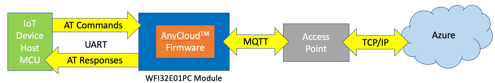
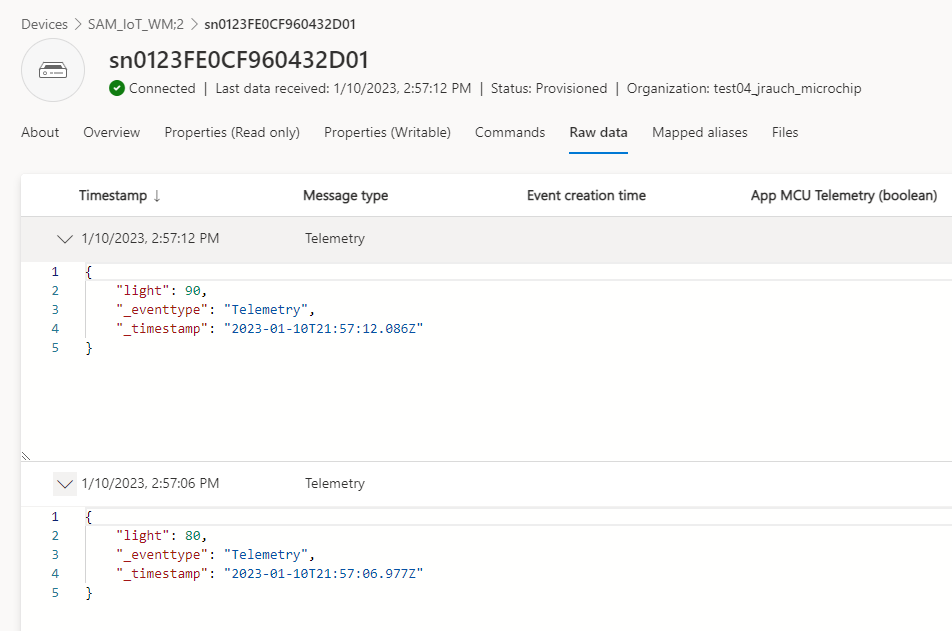
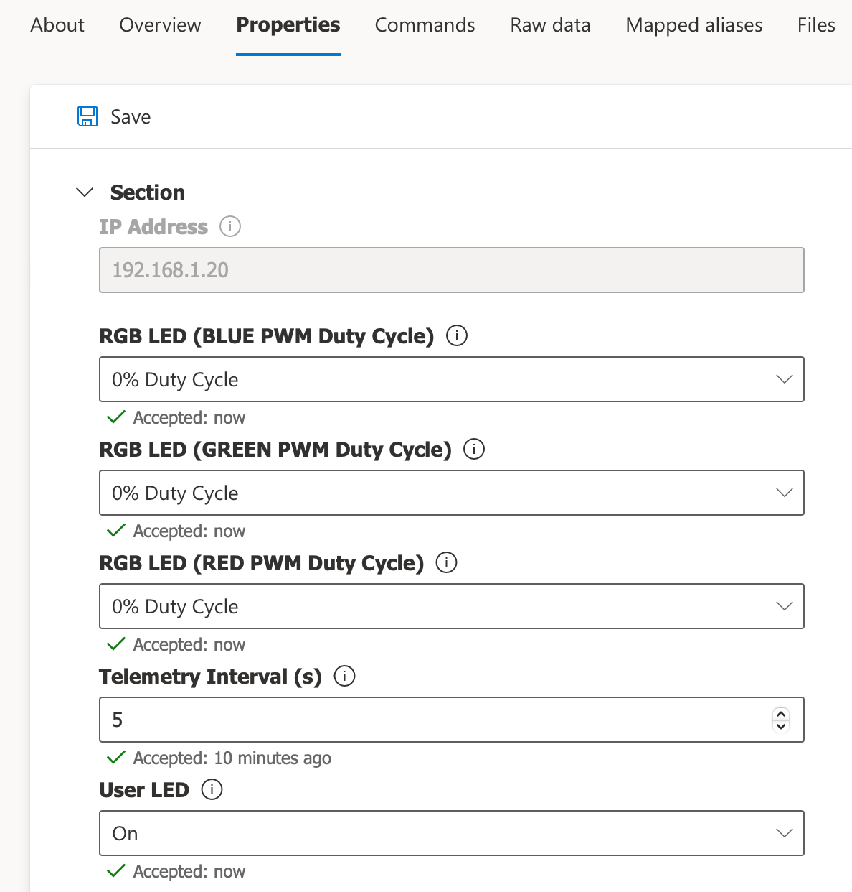

# Connecting to Azure IoT Central using Microchip's UART-to-AnyCloud™ Solution

## Introduction

[AnyCloud™](https://github.com/MicrochipTech/PIC32MZW1_AnyCloud) is a Cloud connectivity solution package for Microchip's [WFI32E01PC](https://www.microchip.com/en-us/product/WFI32E01PC) IoT module that runs on the [PIC32 WFI32E Curiosity Board](https://www.microchip.com/en-us/development-tool/EV12F11A) or the [WFI32-IoT Development Board](https://www.microchip.com/en-us/development-tool/ev36w50a). The [AnyCloud™](https://github.com/MicrochipTech/PIC32MZW1_AnyCloud) solution includes a full set of firmware to enable custom modifications and the default binary image that can be used as well. The solution is publicly available on [Microchip Technology's GitHub account](https://github.com/MicrochipTech). To review the software, clone the repository, or simply download a ZIP file, access the [AnyCloud™](https://github.com/MicrochipTech/PIC32MZW1_AnyCloud) repository on [GitHub](https://github.com).

The [WFI32E01PC](https://www.microchip.com/en-us/product/WFI32E01PC) module (which has been provisioned with the [AnyCloud™](https://github.com/MicrochipTech/PIC32MZW1_AnyCloud) firmware) is meant to act as a "UART to Cloud" bridge to enable the Host MCU of an IoT device to easily connect to (and communicate with) a cloud application. In this example, a PC runs various Python scripts to emulate the operations that a Host MCU would need to execute in order to authenticate, connect, and communicate with a Microsoft Azure IoT Central application.



## Software Prerequisites / Tools Installation

* [Git](https://git-scm.com/)
* [Python 3.0](https://www.python.org/download/releases/3.0/)
* [Python Serial Port Extension](https://pypi.org/project/pyserial/)
* [OpenSSL](https://www.openssl.org)

## Getting Started

### Step 1 - Install the AnyCloud™ Firmware onto the Development Board

Follow all of the existing instructions found in the [AnyCloud™ Getting Started Guide](https://github.com/MicrochipTech/PIC32MZW1_AnyCloud/blob/main/README.md) to get the hardware platform set up and verified. During the setup process, you will discover the Virtual COM port number that is associated with your board's USB-to-UART serial connection with your PC. For example, with the help of the the Windows Device Manager, under the category `Ports (COM & LPT)`, the Virtual COM port may show up as a "USB Serial Device" as illustrated here:


#### 1.1 Using the text editor of your choice, open the `AzureAnyCloud.py` script and locate the following line towards the top of the file:

```bash
COM_PORT = "your_COM_Port"
```
For example, if the USB Serial Device is associated with `COM4`, then the line would need to be changed to look like the following:

```bash
COM_PORT = "COM4"
```

Edit this line to reflect the Virtual COM port associated with your board's USB serial connection and save your changes to the script.

#### 1.2 Open the `WFI32_DeviceCert.py` script and repeat the same process for setting the COM port.

#### 1.3 Open the `WFI32_RootCert.py` script and repeat the same process for setting the COM port.

<br>

**Note** After the MPLAB X IPE has completed the programming of the FW image (HEX file), the IPE holds the WFI32 module in reset, so the board should be disconnected from the USB cable and then reconnected in order for the [AnyCloud™](https://github.com/MicrochipTech/PIC32MZW1_AnyCloud) firmware to run after it has been programmed.

Recommendations:

Clone the repository to your local machine, even if you are not planning to rebuild the project initially.  This provides a local copy of the README file, you can review project source code to self-support, and it includes the pre-built HEX file that can be programmed without rebuilding if that is your wish. 

    git clone https://github.com/MicrochipTech/PIC32MZW1_AnyCloud

**Note** To execute AT commands from a terminal to learn the [AnyCloud™](https://github.com/MicrochipTech/PIC32MZW1_AnyCloud) software, make sure the terminal application has the capability to append `\r\n` (Carriage Return + Line Feed) to the commands you are executing.  The AT commands are not executed without the `\r\n` terminating characters.  

### Step 2 - Read the Root and Device Certificates from the Module

The device certificate file will be needed when we create the device in Azure IoT Central using the individual enrollment method. Another option is to use the group enrollment method which requires uploading the root certificate file to the Azure IoT Central application, so that any device which presents a leaf certificate that was derived from the root certificate will automatically be granted access to registration.

#### 2.1 The **Device** certificate can be read out of the WFI32 module by executing the `WFI32_DeviceCert.py` script. The certificate file will be named based on the device's Common Name (i.e. `<"COMMON_NAME">.PEM`). Execute the following command in a PowerShell or Command Prompt window:

    python3 WFI32_DeviceCert.py

#### 2.2 Use OpenSSL to verify that the Common Name used in the device certificate matches the name of the PEM file which was auto-generated by the script. The following command will list certificate details in an easy to read format:
    
    openssl x509 -in <"COMMON_NAME">.PEM -text

The output of the command will show all fields, but the common name is what is required to register a device into an IoT Central application.  This common name (a.k.a. device ID) is shown in the Subject's *CN* field as illustrated below. In this example, the Subject's CN = sn0123FE0CF960432D01:

    Certificate:
    Data:
        Version: 3 (0x2)
        Serial Number:
            58:e6:60:93:53:e9:7b:45:79:25:15:c6:7e:cf:49:41
        Signature Algorithm: ecdsa-with-SHA256
        Issuer: O = Microchip Technology Inc, CN = Crypto Authentication Signer 2C60
        Validity
            Not Before: Nov 11 07:00:00 2020 GMT
            Not After : Nov 11 07:00:00 2048 GMT
        Subject: O = Microchip Technology Inc, CN = sn0123FE0CF960432D01
        Subject Public Key Info:
            Public Key Algorithm: id-ecPublicKey
                Public-Key: (256 bit)
                pub:
                    04:58:ad:8a:f1:d9:9d:c7:7f:4d:92:3d:0d:e8:49:
                    8b:4c:e8:ea:60:81:ce:e0:0e:a6:a7:68:3f:e0:de:
                    ....

#### 2.3 The **Root** certificate can be read out of the WFI32 module by executing the `WFI32_RootCert.py` script. The certificate file will be named `RootCA.PEM`. Execute the following command in a PowerShell or Command Prompt window:

    python3 WFI32_RootCert.py

### Step 3 - Create an Azure IoT Central Application

If you already have an existing IoT Central Application created, skip to Step 4.

#### 3.1 Create an Azure Account and Subscription

Microsoft has excellent instructions to create an new Azure account and subscription.  Please create an account and subscription before continuing. Review our overview of the [Azure Account/Subscription creation process](./CreateAzureAccountAndSubscription.md) as required.

#### 3.2 Create an Azure IoT Central Application

Refer to the linked instructions to [create an Azure IoT Central Application](./CreateAnIoTCentralApplication.md).

### Step 4 - Enroll Your Device in the Azure IoT Central Application

Choose either the [Group](./IoT_Central_Group_Enrollment.md) or [Individual](./IoT_Central_Individual_Enrollment.md) enrollment method to register your device with the IoT Central application. [Group enrollment](https://learn.microsoft.com/en-us/azure/iot-dps/concepts-service#enrollment-group) allows you to create a group of allowable devices which each have a leaf certificate derived from a common root certificate so that devices do not need to be pre-enrolled on an individual basis. Enrollment groups are used to enroll multiple related devices; [Individual enrollment](https://learn.microsoft.com/en-us/azure/iot-dps/concepts-service#individual-enrollment) is used to enroll a single device. Feel free to review both methods and be sure to complete your preferred method before proceeding with the next step.

### Step 5 - Configuring the AzureAnyCloud Script

1. Open the `AzureAnyCloud.py` script in a text editor of your choice

    

2. Enter your WiFi network's SSID and passphrase as the *WiFi Credentials*
3. Enter your ID scope and Device ID (Common Name) into the *Azure Application/Device Information* settings.
4. Enter the model ID of the device template you wish to interact with in IoT Central.  Example, we can emulate the SAM-IoT Demonstration board from the script using *`dtmi:com:Microchip:SAM_IoT_WM;2`* as the model ID. 

The model ID will be declared during the DPS registration process.  If the model is published in the [Azure Device Model Repository](https://devicemodels.azure.com), IoT Central will automatically download the device model and use it to interact with your device based on the model's characteristics.  You can also create a custom device template in your IoT Central application, which will generate a new model ID that can declared and used with the [AnyCloud™](https://github.com/MicrochipTech/PIC32MZW1_AnyCloud) repository on [GitHub](https://github.com) as well.

### Step 6 - Run the AzureAnyCloud Script

To run the Azure IoT Central script type the following command line:

    python3 AzureAnyCloud.py

The script will check if you are connected to a WiFi network. If you are not connected, it will issue commands to connect with the SSID and passphrase provided.

    --------------------------------------------------------------------------------
    Starting the AnyCloud Azure IoT Central Demonstration
    --------------------------------------------------------------------------------


    Press ESC to Exit the script

    Start Initialization...
    .............................
    ATE1
    OK
    >
    AT+WSTA
    +WSTA:0
    OK
    >
    Event: WiFi not connected, initialializing
    AT+WSTAC=1,"your_SSID"
    OK
    >
    AT+WSTAC=2,3
    OK
    >
    AT+WSTAC=3,"your_PASSPHRASE"
    OK
    >
    AT+WSTAC=4,255
    OK
    >
    AT+WSTAC=12,"pool.ntp.org"
    OK
    >
    AT+WSTAC=13,1
    OK
    >
    AT+WSTA=1
    OK
    >
    +WSTALU:"5C:76:95:1B:D9:2F",6
    >
    +WSTAAIP:"10.0.0.156"
    >
    Event: WiFi connected

It will then check if you are already connected to an MQTT broker.  If not, it will issue the commands to connect to the Azure DPS server. The DPS server uses a common host address to handle all requests. The unique device ID entered into the top of the script is used for the MQTT Client ID (MQTTC=3), and it is also part of the user name parameter (MQTTC=4). The ID Scope identifies your application which is also part of the username field.

    AT+MQTTCONN
    +MQTTCONN:0
    OK
    >
    Broker disconnected....

    AT+MQTTC=1,"global.azure-devices-provisioning.net
    OK
    >
    AT+MQTTC=2,8883
    OK
    >
    AT+MQTTC=3,"your_DEVICE_ID"
    OK
    >
    AT+MQTTC=4,"your_ID_SCOPE/registrations/your_DEVICE_ID/api-version=2019-03-31"
    OK
    >
    AT+MQTTC=7,1
    OK
    >
    AT+MQTTCONN=1
    OK
    >
    +MQTTCONNACK:0,0
    >
    +MQTTCONN:1
    >
    Event: MQTT broker connected

    Event: DPS subscription recieved notification
Finally, the script subscribes to the DPS MQTT notification topic, and publishes to a topic that registers the device.  The initial publish to the registration topic includes the model ID as the payload.  The result of this publication will be a JSON message with an "operationID" field, and the status "assigning".  The code then delays 3 seconds, and issues a polling request to a second topic to determine if the registration is complete.  If the status is still "assigning", it will continue to delay 3 seconds and poll the registration status until the response status is "assigned".  Once the status is "assigned", the response will include a "assignedHub" key, with the host name for the Azure IoT Central application.

    subscribe to DPS result topic
    AT+MQTTSUB="$dps/registrations/res/#",0
    OK
    >
    +MQTTSUB:0
    >

    Event: Subscribed to DPS topics, publish registration request....

    publish DPS registration message
    AT+MQTTPUB=0,0,0,"$dps/registrations/PUT/iotdps-register/?rid=1","{\"payload\" : {\"modelId\" : \"dtmi:com:Microchip:SAM_IoT_WM;2\"}}"
    OK
    >
    +MQTTPUB:47,"$dps/registrations/res/202/?$rid=&retry-after=3",94,"{"operationId":"4.65f62b2644c85bb1.331ffb1b-35e2-4b5a-9e68-f1fa7d5efc33","status":"assigning"}"
    >
    Event: DPS subscription recieved notification
    --------------------------------
    subscription topic received
      "$dps/registrations/res/202/?$rid=&retry-after=3"
    subcription payload recieved
    {
        "operationId": "4.65f62b2644c85bb1.331ffb1b-35e2-4b5a-9e68-f1fa7d5efc33",
        "status": "assigning"
    }
    --------------------------------
    AT+MQTTPUB=0,0,0,"$dps/registrations/GET/iotdps-get-operationstatus/?$rid=2&operationId=4.65f62b2644c85bb1.331ffb1b-35e2-4b5a-9e68-f1fa7d5efc33",""
    OK
    >
    +MQTTPUB:48,"$dps/registrations/res/202/?$rid=2&retry-after=3",177,"{"operationId":"4.65f62b2644c85bb1.331ffb1b-35e2-4b5a-9e68-f1fa7d5efc33","status":"assigning","registrationState":{"registrationId":"sn0123FE0CF960432D01","status":"assigning"}}"
    >
    Event: DPS subscription recieved notification
    --------------------------------
    subscription topic received
      "$dps/registrations/res/202/?$rid=2&retry-after=3"
    subcription payload recieved
    {
        "operationId": "4.65f62b2644c85bb1.331ffb1b-35e2-4b5a-9e68-f1fa7d5efc33",
        "status": "assigning",
        "registrationState": {
            "registrationId": "sn0123FE0CF960432D01",
            "status": "assigning"
        }
    }
    Event: DPS subscription recieved notification
    --------------------------------
    subscription topic received
      "$dps/registrations/res/200/?$rid=3"
    subcription payload recieved
    {
        "operationId": "4.65f62b2644c85bb1.331ffb1b-35e2-4b5a-9e68-f1fa7d5efc33",
        "status": "assigned",
        "registrationState": {
            "x509": {
                "enrollmentGroupId": "dac6db18-b4fb-48ed-b79a-c9f9954956a9"
            },
            "registrationId": "sn0123FE0CF960432D01",
            "createdDateTimeUtc": "2023-01-10T21:52:50.5898405Z",
            "assignedHub": "iotc-524cd5bf-f583-46a6-9ac4-873783da764e.azure-devices.net",
            "deviceId": "sn0123FE0CF960432D01",
            "status": "assigned",
            "substatus": "initialAssignment",
            "lastUpdatedDateTimeUtc": "2023-01-10T21:52:52.1928267Z",
            "etag": "IjYyMDI0NGRkLTAwMDAtMDcwMC0wMDAwLTYzYmRkZTM0MDAwMCI="
        }
    }
    --------------------------------


At this point, the DPS process has completed.  The application will disconnect from the DPS server.  

**Note:** AnyCloud does not support simultaneous connections to multiple MQTT brokers, so the disconnect step is required.

    Registration complete, connect to Azure IoT Central

    AT+MQTTDISCONN
    OK
    >
    +MQTTCONN:0
    >


The application is now ready to connect to IoT Central.  The script will setup the MQTT client with new connection information.  This includes using the host name (`assignedHub`) received from DPS as the MQTT server name.  The clientID remains the `deviceId`.  The user name is updated to a new format.

MQTT client user name = <`IOTC host name from DPS`>/<`deviceId`>/?`api-version=2021-04-12"`

**Note** The Azure IoT Central documentation will indicate the `api-version` above is recommended but optional, but some behaviors demonstrated later in this script will not work if the `api-version` field is ommited.

The commands executed to connect to connect to IoT Central follow below.  

    AT+MQTTC=1,"your_HOST_NAME_ID_FROM_DPS"
    OK
    >
    AT+MQTTC=2,8883
    OK
    >
    AT+MQTTC=3,"your_DEVICE_ID"
    OK
    >
    AT+MQTTC=4,"your_HOST_NAME_ID_FROM_DPS/your_DEVICE_ID/?api-version=2021-04-12"
    OK
    >
    AT+MQTTC=7,1
    OK
    >
    AT+MQTTCONN=1
    OK
    >
    +MQTTCONNACK:0,0
    >
    +MQTTCONN:1
    >

After the connection is completed, the next behavior is subscribing to the three topics are used by Azure IoT Central to communicate with devices.  The first topic recieves commands from IoT Central.  The second is notified when you request the device twin status.  The final topic is used for property updates.

    AT+MQTTSUB="$iothub/methods/POST/#",1
    OK
    >
    +MQTTSUB:0
    >
    AT+MQTTSUB="$iothub/twin/res/#",1
    OK
    >
    +MQTTSUB:0
    >
    AT+MQTTSUB="$iothub/twin/PATCH/properties/desired/#",1
    OK
    >
    +MQTTSUB:0
    >

Once the topics are subcribed, the script requests the current status of the device twin from IoT Central by publishing to the `$iothub/twin/GET/` topic.  That is met by a response that is every property that has been previously writen by the device, including parameters updated during previous connections.  The script prints out a pretty version of the JSON object recieved, and grabs the telemetry interval, which will be adopted as the rate periodic telemetry is sent to IOTC later on.

    Read current device twin settings from IOTC

    AT+MQTTPUB=0,0,0,"$iothub/twin/GET/?$rid=4",""
    OK
    >
    +MQTTPUB:28,"$iothub/twin/res/200/?$rid=4",517,"{"desired":{"telemetryInterval":5,"led_y":3,"property_3":7,"property_4":8,"disableTelemetry":0,"$version":101},"reported":{"led_b":0,"telemetryInterval":{"ac":200,"av":101,"ad":"telemetryInterval set to: 5","value":5},"property_3":{"ac":200,"av":95,"ad":"property_3 set to: 7","value":7},"disableTelemetry":{"ac":200,"av":96,"ad":"disableTelemetry set to: 0","value":0},"led_y":{"ac":200,"av":100,"ad":"led_y set to: 3","value":3},"property_4":{"ac":200,"av":95,"ad":"property_4 set to: 8","value":8},"$version":145}}"
    >
    --------------------------------
    subscription topic received
      "$iothub/twin/res/200/?$rid=4"
    subcription payload recieved
    {
        "desired": {
            "telemetryInterval": 5,
            "led_y": 3,
            "property_3": 7,
            "property_4": 8,
            "disableTelemetry": 0,
            "$version": 101
        },
        "reported": {
            "led_b": 0,
            "telemetryInterval": {
                "ac": 200,
                "av": 101,
                "ad": "telemetryInterval set to: 5",
                "value": 5
            },
            "property_3": {
                "ac": 200,
                "av": 95,
                "ad": "property_3 set to: 7",
                "value": 7
            },
            "disableTelemetry": {
                "ac": 200,
                "av": 96,
                "ad": "disableTelemetry set to: 0",
                "value": 0
            },
            "led_y": {
                "ac": 200,
                "av": 100,
                "ad": "led_y set to: 3",
                "value": 3
            },
            "property_4": {
                "ac": 200,
                "av": 95,
                "ad": "property_4 set to: 8",
                "value": 8
            },
        "$version": 145
        }
    }
    --------------------------------
    telemetryInterval set to 5 based on Device Twin State    
    
    Sending Telemetry and Properties.
        Press ESC to end script

The script continues to demonstrate publishing telemetry and a read-only property.

     Publish Hello World telemetry
     Sending telemetry_Str_1 telemetry value of: "Hello Azure IoT Central"

     AT+MQTTPUB=0,0,0,"devices/sn0123FE0CF960432D01/messages/events/","{\"telemetry_Str_1\" : \"Hello Azure IoT Central\"}"
     OK
     >

     Set led_b read-only property initial value: OFF
     Sending led_b property value of: 0

     AT+MQTTPUB=0,0,0,"$iothub/twin/PATCH/properties/reported/?rid=5","{\"led_b\" : 0}"
     OK
     >

If you login to your application on IoT Central, it is now possible to see the how the script is interacting with the IoT Central application.

Start by looking at the devices registered to the application.  Click **Devices** on the left naviagation pane, and note that the device shows up with the common name from the x.509 certifcate as its *Device ID*.  Also note the *Device Template* selected is now `SAM_IoT_WM;2`.  This device template was configured during the connection to the Device Provisioning Service.


If you click the device name shown on the devices screen, IoT Central will show you are currently connected. You will also have the ability to click on a selection of device views that allow you to inspect the device state and data from recent transactions.  I have selected the **Raw data** view.


Scrolling down to the first two transactions sent after the connection to IoT Central was established, you can expand them to see the values written by the "Hello World" portion of the script.  The led_b and telemetry_Str_1 values are shown below.


After these initial values are sent, the script begins publishing spoofed light sensor telemetry at the "telemetryInterval" rate.  The telemetry interval defaults to 10 seconds, but this is a writeable property that can be updated from IoT Central.



Leveraging a view that allows editting writeable properties, type a new value for the telemetryInterval and save it.
**Note** Configuring additional device views is beyond the scope of this documentation


IoT Central will publish a message to the property PATCH topic.  The message will contain the new telemetry interval value, as well as a version field.

    property updated from IoT Central
    -------------------------------
    subscription topic received
      "$iothub/twin/PATCH/properties/desired/?$version=105"
    subcription payload recieved
    {
        "telemetryInterval": 5,
        "$version": 105
    }
    --------------------------------
    $version = 105
    telemetryInterval set to: 5

    Light sensor telemetry updating at the new telemetry interval
    Check Raw Data tab to verify

The Plug-n-Play standard requries acknowledging these messages.  The AnyCloud response payload is show below.

    AT+MQTTPUB=0,0,0,"$iothub/twin/PATCH/properties/reported/?rid=8","{\"telemetryInterval\" : {\"ac\" : 200, \"av\" : 105, \"ad\" : \"telemetryInterval set to: 5\", \"value\" : 5}}"
    OK
    > 
A pretty version of the response payload follows for readability

    {
        "telemetryInterval": {
            "ac": 200,
            "av": 105,
            "ad": "telemetryInterval set to: 5",
            "value": 5
        }
    }

There are several things to note in the response.  The response to a writeable property must be in a specific format.  It includes an acknowledge code ("ac"), which is essentially an HTTP status code. "200" for OK.  Other codes are availble to indicate problematic states. The version number recieved with the telemetry interval is a value used to serialize and track the requests.  The version recieved in the write request must be returned in the acknowledge version ("av") field of the response.  "ad" is an optional string that can be included for a descriptive text, and the last field returned is the updated value for the received property. 

Depending how quickly the write propery response is received, it is possible that IoT Central will show the value as pending. If the device is offline or doesn't respond to writeable property request, the value can display as pending forever in IoT Central.

The last item the script demonstrates is receiving cloud to device commands, which are referred to as methods in the IoT central documentation.  To send a method request to the embedded device, IoT Central publishes to methods POST topic, with the command name included in the topic path.  In the example below, the method name is reboot.

    $iothub/methods/POST/reboot/

This can be demonstrated directly from IoT Central on the device's commands tab.


"PT5S" is an [ISO 8601](https://en.wikipedia.org/wiki/ISO_8601) period designator, which decodes to 5 seconds following the standard's definition.  The script only supports periods in seconds, but the standard covers durations years, months, days, etc.

    'P'eriod 
    'T'ime 
     5
    'S'econds

After you enter a valid field, the **Run** button can be pressed.

IoT Central will publish to the topic described above with the payload defined in the device twin.  The script parses the command name out of the topic, decodes the delay value in the published payload, and prints the command to be executed.  The python script does reboot the PC, but if you were to run this exercise on a SAM-IoT board the board would be reset in 5 seconds after receiving the command.

    +MQTTPUB:35,"$iothub/methods/POST/reboot/?$rid=1",16,"{"delay":"PT5S"}"
    >
    received command from IoT Central
    --------------------------------
    subscription topic received
      "$iothub/methods/POST/reboot/?$rid=1"
    subcription payload recieved
    {
        "delay": "PT5S"
    }
    --------------------------------

    execute reboot(5)

When the `SAM_IoT_WM;2` device twin was defined, part of that definition included a response packet for the command.  The device twin structure can be viewed in IoT Central, by selecting "Device Templates, then the name and version of the device template being used.


When the device template opens, expand the reboot command with the drop down control.  


Notice the command is enabled, and a response is expected.  There are also two objects being defined: one for the command playload, and one for the response payload. Click the Define button for the response payload, to view the object that is expected to be returned by the embedded device when the reboot command is recieved. 


From here notice two items are expected in the response payload, a "status" string, and a "delay" integer, that should match the reboot delay.  

Two other things are dictated by the plug-n-play method response standard.  The response topic published to, includes an status code in the path of the topic, and the the rid value recieved with the method request.  

The response code is typically "200" for OK, and the rid value is handled much like the version field of property write resopnses. 

So the response topic follows this pattern: "$iothub/methods/res/`Response Code`/?$rid=`Request_RID`"

Putting it all together for for the example reboot command received above, the response published has the following topic and payload.


    AT+MQTTPUB=0,0,0,"$iothub/methods/res/200/?$rid=1","{\"status\" : \"Success\", \"delay\" : 5}"
    OK
    >

