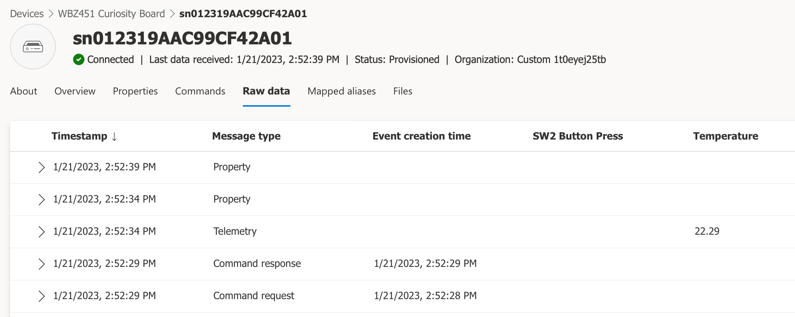

# Connecting to Azure IoT Central using Microchip's UART-to-AnyCloud™ Solution

## Introduction

[AnyCloud™](https://github.com/MicrochipTech/PIC32MZW1_AnyCloud) is a Cloud connectivity embedded firmware package for Microchip's [WFI32E01PC](https://www.microchip.com/en-us/product/WFI32E01PC) IoT module that runs on the [PIC32 WFI32E Curiosity Board](https://www.microchip.com/en-us/development-tool/EV12F11A) or the [WFI32-IoT Development Board](https://www.microchip.com/en-us/development-tool/ev36w50a). The [AnyCloud™](https://github.com/MicrochipTech/PIC32MZW1_AnyCloud) solution includes a full set of firmware source code to enable custom modifications and the default binary image that can be used straight "out of the box". The solution is publicly available on [Microchip Technology's GitHub account](https://github.com/MicrochipTech). To review the software, clone the repository, download a ZIP file, or just get the latest release of the AnyCloud™ binary file, access the [AnyCloud™](https://github.com/MicrochipTech/PIC32MZW1_AnyCloud) repository on [GitHub](https://github.com).

The [WFI32E01PC](https://www.microchip.com/en-us/product/WFI32E01PC) module (which has been provisioned with the [AnyCloud™](https://github.com/MicrochipTech/PIC32MZW1_AnyCloud) firmware) is meant to act as a "UART to Cloud" bridge to enable the Host MCU of an IoT device to easily connect to (and communicate with) a cloud application. In this example, we first use a PC to run Python scripts to emulate the operations that a Host MCU would need to execute in order to authenticate, connect, and communicate with a Microsoft Azure IoT Central application. For a more real-world case, the second part of this example uses an actual Host MCU development board which performs the same operations as the Python scripts. The full set of source code for the embedded application is provided to use as a baseline for actual production designs!


## Hardware Requirements

* PC Interface to AnyCloud™ Serial Bridge: [USB-to-UART Serial Adapter/Bridge/Converter](https://www.newark.com/c/cable-wire-cable-assemblies/cable-assemblies/usb-adapter-cables?conversion-type=usb-to-uart-converter)
* Host MCU Development Board: [WBZ451 Curiosity Board](https://www.microchip.com/en-us/development-tool/EV96B94A)

    
* AnyCloud™ Serial Bridge: [WFI32-IoT Development Board](https://www.microchip.com/en-us/development-tool/ev36w50a) **or** [PIC32 WFI32E Curiosity Board](https://www.microchip.com/en-us/development-tool/EV12F11A)

    

## Software Prerequisites / Tools Installation

1. [Git](https://git-scm.com/)
2. [Python 3.0](https://www.python.org/download/releases/3.0/)
3. [Python Serial Port Extension](https://pypi.org/project/pyserial/)
4. [OpenSSL](https://wiki.openssl.org/index.php/Binaries)
5. Any [Terminal Emulator](https://en.wikipedia.org/wiki/List_of_terminal_emulators) program of your choice
6. Microchip `MPLAB X IDE` tool chain for embedded code development on 32-bit architecture MCU/MPU platforms (made up of 3 major components)

    - [MPLAB X IDE (minimum v6.05)](https://www.microchip.com/mplab/mplab-x-ide) (when prompted, enable the installation of the [MPLAB IPE](https://www.microchip.com/en-us/tools-resources/production/mplab-integrated-programming-environment) too)

    - [MPLAB XC32 Compiler (minimum v4.20)](https://www.microchip.com/en-us/development-tools-tools-and-software/mplab-xc-compilers#tabs)

        NOTE: This demonstration project was tested successfully with XC32 v4.20, and in general should work with later versions of the compiler as they become available. If you encounter issues building the project with a newer version of the compiler, it is recommended to download XC32 v4.20 from the [MPLAB Development Ecosystem Downloads Archive](https://www.microchip.com/en-us/tools-resources/archives/mplab-ecosystem) (to fall back to the version Microchip successfully tested prior to release). 

     - [MPLAB Harmony Software Framework](https://microchipdeveloper.com/harmony3:mhc-overview)

## Getting Started - Using a PC to Emulate a Host MCU

### Step 1 - Set up a WFI32E01 Development Board as an AnyCloud™ UART-to-Cloud Bridge

Follow the section titled "Re-Flashing the device" in the [AnyCloud™ Getting Started Guide](https://github.com/MicrochipTech/PIC32MZW1_AnyCloud/blob/main/README.md) to program the AnyCloud™ firmware onto one of the WFI32E01 development boards (if using WFI32-IoT, skip the step regarding a jumper setting).

After the AnyCloud™ firmware has been programmed, create a clone of this repository using [Git](https://git-scm.com)

```bash
git clone https://github.com/MicrochipTech/AzureDemo_AnyCloud
```

...or do the following: scroll up towards the top of this page, click on the **Code** button, and download a ZIP file of this repository


Connect a [USB-to-UART converter](https://www.newark.com/c/cable-wire-cable-assemblies/cable-assemblies/usb-adapter-cables?conversion-type=usb-to-uart-converter) between the PC and the specified header for the specific WFI32E01 development board being used:

- [WFI32-IoT](https://www.microchip.com/en-us/development-tool/ev36w50a): Connect the USB-to-UART converter's TXD & RXD pins to the `RX` & `TX` pins of the mikroBUS Header (`J402`), respectively (an additional connection to GND may also be required)

    

- [PIC32 WFI32E Curiosity](https://www.microchip.com/en-us/development-tool/EV12F11A): Connect the USB-to-UART converter's TXD & RXD pins to to the `U1RX` & `U1TX` pins of the GPIO Header (`J207`), respectively (an additional connection to GND may also be required)

    

**Note** After the MPLAB IPE has completed the programming of the AnyCloud firmware image (HEX file), the IPE program holds the WFI32 module in reset, so the board should be disconnected from the USB cable and then reconnected in order for the [AnyCloud™](https://github.com/MicrochipTech/PIC32MZW1_AnyCloud) firmware to run after it has been programmed.

 You will need to discover the Virtual COM port number that is associated with your USB-to-UART converter's serial connection with your PC. For example, with the help of the the Windows `Device Manager`, under the category `Ports (COM & LPT)`, the Virtual COM port may show up as a generic "USB Serial Device" as illustrated here:


**Note** For MacOS users - from a `Terminal` window, execute the following command line
```bash
ls /dev/tty.usb*
```
to see a list of all USB devices which have been assigned to serial ports - most likely one of them is the string that will be assigned to the `COM_PORT` variable in the script

#### 1.1 Navigate to the [/examples/PC_Python](./examples/PC_Python/) directory. Create a copy of the `AzureAnyCloud.py` file and rename it to something more specific (e.g. `AzureAnyCloud_<YOURINITIALS>.py` (in order to preserve the original baseline script in case you need to reference it again in the future)

#### 1.2 Using the text editor of your choice, open the newly-created `AzureAnyCloud_<YOURINITIALS>.py` file and locate the following line towards the top of the file:

```bash
COM_PORT = "your_COM_Port"
```

Edit this line to reflect the Virtual COM port associated with your USB-to-UART converter's serial connection and save your changes to the script. For example, if the Windows Device Managers shows the USB Serial Device is associated with `COM4`, then the line would need to be changed to look like the following:

```bash
COM_PORT = "COM4"
```

Alternatively for MacOS users - the COM_PORT setting may look something like

```bash
COM_PORT = "/dev/tty.usbserial-A51MXHIL"
```

#### 1.3 Navigate to the [/certificates](./certificates/) directory. Open the `WFI32_ClientCert.py` script and repeat the same process for setting the `COM_PORT` variable. After saving the changes, close the file and then reopen the file to confirm that the COM port was correctly updated. In the same directory, repeat this COM port setting in **both** the `WFI32_RootCert.py` and `WFI32_SignerCert.py` scripts. Confirm that all 3 Python scripts have been updated correctly.  

#### 1.4 Cycle power to the board by disconnecting and reconnecting the USB cable. For good measure, press the `RESET` button on the WFI32-IoT development board (for the WFI32E Curiosity development board, the reset button is the `MCLR` button)

### Step 2 - Read the Root, Signer, & Client Certificates from the Module

The client certificate file will be needed when we create the device in Azure IoT Central using the individual enrollment method. Another option is to use the group enrollment method which requires uploading the signer certificate file (or in some cases, could be the root certificate if the client certificate is chained directly to it) to the Azure IoT Central application, so that any device which presents a leaf certificate that was derived from the signer (or root) certificate will automatically be granted access to registration.

#### 2.1 The **Client** certificate can be read out of the WFI32 module by executing the `WFI32_ClientCert.py` script in the [/certificates](./certificates/) directory. The certificate file will be named based on the device's Common Name (i.e. `<"COMMON_NAME">.PEM`). Execute the following command in a PowerShell or Command Prompt window:

    python3 WFI32_ClientCert.py

**Note** If the development board is not responding to the script's commands, kill the python operation, press the reset button on the development board, and re-run the script

#### 2.2 Use OpenSSL to verify that the Common Name used in the client certificate matches the name of the PEM file which was auto-generated by the script. The following command will list certificate details in an easy to read format:
    
    openssl x509 -in <"COMMON_NAME">.PEM -text

The output of the command will show all fields, but the common name is what is required to register a device into an IoT Central application.  This common name (a.k.a. device ID) is shown in the Subject's *CN* field as illustrated below. In this example, the Subject's CN = sn0123FE0CF960432D01:

    Certificate:
    Data:
        Version: 3 (0x2)
        Serial Number:
            58:e6:60:93:53:e9:7b:45:79:25:15:c6:7e:cf:49:41
        Signature Algorithm: ecdsa-with-SHA256
        Issuer: O = Microchip Technology Inc, CN = Crypto Authentication Signer 2C60
        Validity
            Not Before: Nov 11 07:00:00 2020 GMT
            Not After : Nov 11 07:00:00 2048 GMT
        Subject: O = Microchip Technology Inc, CN = sn0123FE0CF960432D01
        Subject Public Key Info:
            Public Key Algorithm: id-ecPublicKey
                Public-Key: (256 bit)
                pub:
                    04:58:ad:8a:f1:d9:9d:c7:7f:4d:92:3d:0d:e8:49:
                    8b:4c:e8:ea:60:81:ce:e0:0e:a6:a7:68:3f:e0:de:
                    ....

#### 2.3 The **Root** certificate can be read out of the WFI32 module by executing the `WFI32_RootCert.py` script in the [/certificates](./certificates/) directory. The certificate file will be named `RootCA.PEM`. Execute the following command in a PowerShell or Command Prompt window:

    python3 WFI32_RootCert.py

**Note** If the development board is not responding to the script's commands, kill the python operation, press the reset button on the development board, and re-run the script

#### 2.4 The **Signer** certificate can be read out of the WFI32 module by executing the `WFI32_SignerCert.py` script in the [/certificates](./certificates/) directory. The certificate file will be named `SignerCA.PEM`. Execute the following command in a PowerShell or Command Prompt window:

    python3 WFI32_SignerCert.py

**Note** If the development board is not responding to the script's commands, kill the python operation, press the reset button on the development board, and re-run the script

### Step 3 - Create an Azure IoT Central Application

If you already have an existing IoT Central Application created, skip to Step 4.

#### 3.1 Create an Azure Account and Subscription

Microsoft has excellent instructions to create an new Azure account and subscription.  Please create an account and subscription before continuing. Review our overview of the [Azure Account/Subscription creation process](./CreateAzureAccountAndSubscription.md) as required.

#### 3.2 Create an Azure IoT Central Application

[Click here](https://docs.microsoft.com/en-us/azure/iot-central/core/quick-deploy-iot-central) and follow **only** the section titled **"Create an application"**.

### Step 4 - Enroll Your Device in the Azure IoT Central Application

Click on one of the following: [Group](./IoT_Central_Group_Enrollment.md) or [Individual](./IoT_Central_Individual_Enrollment.md) enrollment method to register your device with the IoT Central application (creating an enrollment group is recommended as a more practical solution vs. registering each device individually). [Group enrollment](https://learn.microsoft.com/en-us/azure/iot-dps/concepts-service#enrollment-group) allows you to create a group of allowable devices which each have a leaf certificate derived from a common signer or root certificate so that devices do not need to be pre-enrolled on an individual basis. Enrollment groups are used to enroll multiple related devices; [Individual enrollment](https://learn.microsoft.com/en-us/azure/iot-dps/concepts-service#individual-enrollment) is used to enroll a single device. Feel free to review both methods and be sure to complete the procedure for your preferred method before proceeding with the next step.

### Step 5 - Configuring the AzureAnyCloud Script

1. Open the `AzureAnyCloud_<YOURINITIALS>.py` script in a text editor of your choice

    

2. Enter your WiFi network's SSID and passphrase as the *WiFi Credentials*
3. Enter your ID scope and Device ID (Common Name) into the *Azure Application/Device Information* settings.
4. For the Model ID, there is no need to change it since this example emulates an IoT device based on the device model *[`dtmi:com:Microchip:WBZ451_Curiosity;1`](https://github.com/Azure/iot-plugandplay-models/blob/main/dtmi/com/microchip/wbz451-curiosity-1.json)* (which is published in the [IoT Plug and Play Models Repository](https://github.com/Azure/iot-plugandplay-models)). Just confirm that the Model ID is already set correctly by default.

The Model ID will be announced by the device during the DPS registration process.  If the model has been published in the [Azure Device Model Repository](https://devicemodels.azure.com), IoT Central will automatically download the device model and use it to interact with your device based on the model's characteristics.  You can also create a custom device template in your IoT Central application, which will generate a new Model ID that can declared and used with the [AnyCloud™](https://github.com/MicrochipTech/PIC32MZW1_AnyCloud) repository on [GitHub](https://github.com) as well.

### Step 6 - Run the Main "AzureAnyCloud" Script

Press the reset button on the development board. It is always good practice to press the reset button just before each time a new script operation is invoked. To run the main Azure IoT Central script, navigate to the [/examples/PC_Python](./examples/PC_Python/) directory and execute the following command line:

    python3 AzureAnyCloud_<YOURINITIALS>.py

The script will first check to see if you are currently connected to a WiFi network. If you are not connected, it will issue commands to connect with an Access Point using the SSID and passphrase settings.

    --------------------------------------------------------------------------------
    Starting the AnyCloud Azure IoT Central Demonstration
    --------------------------------------------------------------------------------


    Press ESC to Exit the script

    Start Initialization...
    .............................
    ATE1
    OK
    >
    AT+WSTA
    +WSTA:0
    OK
    >
    Event: WiFi not connected, initialializing
    AT+WSTAC=1,"your_SSID"
    OK
    >
    AT+WSTAC=2,3
    OK
    >
    AT+WSTAC=3,"your_PASSPHRASE"
    OK
    >
    AT+WSTAC=4,255
    OK
    >
    AT+WSTAC=12,"pool.ntp.org"
    OK
    >
    AT+WSTAC=13,1
    OK
    >
    AT+WSTA=1
    OK
    >
    +WSTALU:"5C:76:95:1B:D9:2F",6
    >
    +WSTAAIP:"10.0.0.156"
    >
    Event: WiFi connected

It will then check if you are already connected to an MQTT broker.  If not, it will issue the commands to connect to the Azure DPS server. The DPS server uses a common host address to handle all requests. The unique device ID entered into the top of the script is used for the MQTT Client ID (MQTTC=3), and it is also part of the user name parameter (MQTTC=4). The ID Scope identifies your application which is also part of the username field.

    AT+MQTTCONN
    +MQTTCONN:0
    OK
    >
    Broker disconnected....

    AT+MQTTC=1,"global.azure-devices-provisioning.net
    OK
    >
    AT+MQTTC=2,8883
    OK
    >
    AT+MQTTC=3,"your_DEVICE_ID"
    OK
    >
    AT+MQTTC=4,"your_ID_SCOPE/registrations/your_DEVICE_ID/api-version=2019-03-31"
    OK
    >
    AT+MQTTC=7,1
    OK
    >
    AT+MQTTCONN=1
    OK
    >
    +MQTTCONNACK:0,0
    >
    +MQTTCONN:1
    >
    Event: MQTT broker connected

    Event: DPS subscription received notification
Finally, the script subscribes to the DPS MQTT notification topic, and publishes to a topic that registers the device.  The initial publish to the registration topic includes the model ID as the payload.  The result of this publication will be a JSON message with an "operationID" field, and the status "assigning".  The code then delays 3 seconds, and issues a polling request to a second topic to determine if the registration is complete.  If the status is still "assigning", it will continue to delay 3 seconds and poll the registration status until the response status is "assigned".  Once the status is "assigned", the response will include a "assignedHub" key, with the host name corresponding to the IoT Hub which is used by the Azure IoT Central application.

    subscribe to DPS result topic
    AT+MQTTSUB="$dps/registrations/res/#",0
    OK
    >
    +MQTTSUB:0
    >

    Event: Subscribed to DPS topics, publish registration request....

    publish DPS registration message
    AT+MQTTPUB=0,0,0,"$dps/registrations/PUT/iotdps-register/?rid=1","{\"payload\" : {\"modelId\" : \"dtmi:com:Microchip:WBZ451_Curiosity;1\"}}"
    OK
    >
    +MQTTPUB:47,"$dps/registrations/res/202/?$rid=&retry-after=3",94,"{"operationId":"4.65f62b2644c85bb1.331ffb1b-35e2-4b5a-9e68-f1fa7d5efc33","status":"assigning"}"
    >
    Event: DPS subscription received notification
    --------------------------------
    subscription topic received
      "$dps/registrations/res/202/?$rid=&retry-after=3"
    subcription payload received
    {
        "operationId": "4.65f62b2644c85bb1.331ffb1b-35e2-4b5a-9e68-f1fa7d5efc33",
        "status": "assigning"
    }
    --------------------------------
    AT+MQTTPUB=0,0,0,"$dps/registrations/GET/iotdps-get-operationstatus/?$rid=2&operationId=4.65f62b2644c85bb1.331ffb1b-35e2-4b5a-9e68-f1fa7d5efc33",""
    OK
    >
    +MQTTPUB:48,"$dps/registrations/res/202/?$rid=2&retry-after=3",177,"{"operationId":"4.65f62b2644c85bb1.331ffb1b-35e2-4b5a-9e68-f1fa7d5efc33","status":"assigning","registrationState":{"registrationId":"sn0123FE0CF960432D01","status":"assigning"}}"
    >
    Event: DPS subscription received notification
    --------------------------------
    subscription topic received
      "$dps/registrations/res/202/?$rid=2&retry-after=3"
    subcription payload received
    {
        "operationId": "4.65f62b2644c85bb1.331ffb1b-35e2-4b5a-9e68-f1fa7d5efc33",
        "status": "assigning",
        "registrationState": {
            "registrationId": "sn0123FE0CF960432D01",
            "status": "assigning"
        }
    }
    Event: DPS subscription received notification
    --------------------------------
    subscription topic received
      "$dps/registrations/res/200/?$rid=3"
    subcription payload received
    {
        "operationId": "4.65f62b2644c85bb1.331ffb1b-35e2-4b5a-9e68-f1fa7d5efc33",
        "status": "assigned",
        "registrationState": {
            "x509": {
                "enrollmentGroupId": "dac6db18-b4fb-48ed-b79a-c9f9954956a9"
            },
            "registrationId": "sn0123FE0CF960432D01",
            "createdDateTimeUtc": "2023-01-10T21:52:50.5898405Z",
            "assignedHub": "iotc-524cd5bf-f583-46a6-9ac4-873783da764e.azure-devices.net",
            "deviceId": "sn0123FE0CF960432D01",
            "status": "assigned",
            "substatus": "initialAssignment",
            "lastUpdatedDateTimeUtc": "2023-01-10T21:52:52.1928267Z",
            "etag": "IjYyMDI0NGRkLTAwMDAtMDcwMC0wMDAwLTYzYmRkZTM0MDAwMCI="
        }
    }
    --------------------------------


At this point, the DPS process has completed.  The application will disconnect from the DPS server.  

**Note:** AnyCloud™ does not support simultaneous connections to multiple MQTT brokers, so the disconnect step is required.

    Registration complete, connect to Azure IoT Central

    AT+MQTTDISCONN
    OK
    >
    +MQTTCONN:0
    >


The application is now ready to connect to IoT Central.  The script will set up the MQTT client with new connection information.  This includes using the host name (`assignedHub`) received from DPS as the MQTT server name.  The clientID remains the `deviceId`.  The user name is updated to a new format:

MQTT client user name = <`IOTC host name from DPS`>/<`deviceId`>/?`api-version=2021-04-12"`

**Note** The Azure IoT Central documentation will indicate the `api-version` above is recommended but optional, but some behaviors demonstrated later in this script will not work if the `api-version` field is ommitted.

The commands executed to connect to IoT Central follow below.  

    AT+MQTTC=1,"your_HOST_NAME_ID_FROM_DPS"
    OK
    >
    AT+MQTTC=2,8883
    OK
    >
    AT+MQTTC=3,"your_DEVICE_ID"
    OK
    >
    AT+MQTTC=4,"your_HOST_NAME_ID_FROM_DPS/your_DEVICE_ID/?api-version=2021-04-12"
    OK
    >
    AT+MQTTC=7,1
    OK
    >
    AT+MQTTCONN=1
    OK
    >
    +MQTTCONNACK:0,0
    >
    +MQTTCONN:1
    >

After the connection is completed, the next behavior is subscribing to the three topics are used by Azure IoT Central to communicate with devices.  The first topic receives commands from IoT Central.  The second is notified when you request the device twin status.  The final topic is used for property updates.

    AT+MQTTSUB="$iothub/methods/POST/#",1
    OK
    >
    +MQTTSUB:0
    >
    AT+MQTTSUB="$iothub/twin/res/#",1
    OK
    >
    +MQTTSUB:0
    >
    AT+MQTTSUB="$iothub/twin/PATCH/properties/desired/#",1
    OK
    >
    +MQTTSUB:0
    >

Once the topics have been subcribed to, the script requests the current status of the device twin from IoT Central by publishing to the `$iothub/twin/GET/` topic.  That is met by a response that is every property that has been previously writen by the device, including parameters updated during previous connections.  The script prints out a "pretty" version of the JSON object received, and grabs the telemetry interval, which will be adopted as the rate periodic telemetry is sent to IOTC later on.

    Read current device twin settings from IOTC

    AT+MQTTPUB=0,0,0,"$iothub/twin/GET/?$rid=4",""
    OK
    >
    +MQTTPUB:28,"$iothub/twin/res/200/?$rid=4",517,"{"desired":{"telemetryInterval":5,"rgb_led_blue":0,"rgb_led_green":0,"rgb_led_red":0,"led_user":3,"$version":101},"reported":{"telemetryInterval":{"ac":200,"av":101,"ad":"telemetryInterval set to: 5","value":5},"rgb_led_blue":{"ac":200,"av":95,"ad":"rgb_led_blue set to: 0","value":7},"rgb_led_green":{"ac":200,"av":96,"ad":"rgb_led_green set to: 0","value":0},rgb_led_red":{"ac":200,"av":100,"ad":"rgb_led_red to: 0","value":0},"led_user":{"ac":200,"av":95,"ad":"led_user set to: 3","value":3},"$version":145}}"
    >
    --------------------------------
    subscription topic received
      "$iothub/twin/res/200/?$rid=4"
    subcription payload received
    {
        "desired": {
            "telemetryInterval": 5,
            "rgb_led_blue": 0,
            "rgb_led_green": 0,
            "rgb_led_red": 0,
            "led_user": 3,
            "$version": 101
        },
        "reported": {
            "telemetryInterval": {
                "ac": 200,
                "av": 101,
                "ad": "telemetryInterval set to: 5",
                "value": 5
            },
            "rgb_led_blue": {
                "ac": 200,
                "av": 95,
                "ad": "rgb_led_blue set to: 0",
                "value": 0
            },
            "rgb_led_green": {
                "ac": 200,
                "av": 96,
                "ad": "rgb_led_green set to: 0",
                "value": 0
            },
            "rgb_led_red": {
                "ac": 200,
                "av": 100,
                "ad": "rgb_led_red set to: 0",
                "value": 0
            },
            "led_user": {
                "ac": 200,
                "av": 95,
                "ad": "led_user set to: 3",
                "value": 3
            },
        "$version": 145
        }
    }
    --------------------------------
    telemetryInterval set to 5 based on Device Twin State    
    
    Sending Telemetry and Properties.
        Press ESC to end script

If you login to your application on IoT Central, it is now possible to see how the script is interacting with the IoT Central application.

Start by looking at the devices registered to the application.  Click **Devices** on the left naviagation pane, and note that the device shows up with the Common Name (CN) from the X.509 certifcate as its *Device ID*.  Also note the *Device Template* selected is now `WBZ451_Curiosity;1`. This device template was configured during the connection to the Device Provisioning Service because it is published in the [IoT Plug and Play Models Repository](https://github.com/Azure/iot-plugandplay-models).


If you click the device name shown on the devices screen, IoT Central will show you are currently connected. You will also have the ability to click on a selection of device views that allow you to inspect the device state and data from recent transactions; the **Raw data** view is typically the most convenient place to see all incoming & outgoing messages.



Scrolling down to the first two transactions sent after the connection to IoT Central was established, you can expand them to see the values written by the script.


After these initial values are sent, the script begins publishing spoofed temperature sensor telemetry at the "telemetryInterval" rate.  The telemetry interval defaults to 10 seconds, but this is a writeable property that can be updated from IoT Central.


[Click here](./DeviceTemplate_CreatingViews.md) to create a "Properties" view that allows you to change any of the Cloud-writable properties. Once this new view has been added to the device template, click on the Properties view and type in a new value for the Telemetry Interval. Click on the **Save** icon to send the property update request to the physical device. You should see the status of the property listed as "Pending" until a confirmation has been received from the physical device that the property was successfully updated. At this point in time, the status of the property should revert back to the "Accepted" state.


IoT Central will publish a message to the property PATCH topic.  The message will contain the new telemetry interval value, as well as a version field.

    property updated from IoT Central
    -------------------------------
    subscription topic received
      "$iothub/twin/PATCH/properties/desired/?$version=105"
    subcription payload received
    {
        "telemetryInterval": 5,
        "$version": 105
    }
    --------------------------------
    $version = 105
    telemetryInterval set to: 5

    Temperature sensor telemetry updating at the new telemetry interval
    Check Raw Data tab to verify

The Plug-n-Play standard requries acknowledging these messages.  The AnyCloud™ response payload is shown below.

    AT+MQTTPUB=0,0,0,"$iothub/twin/PATCH/properties/reported/?rid=8","{\"telemetryInterval\" : {\"ac\" : 200, \"av\" : 105, \"ad\" : \"telemetryInterval set to: 5\", \"value\" : 5}}"
    OK
    > 
A "pretty" version of the response payload follows for ease of readability

    {
        "telemetryInterval": {
            "ac": 200,
            "av": 105,
            "ad": "telemetryInterval set to: 5",
            "value": 5
        }
    }

There are several things to note in the response.  The response to a writeable property must be in a specific format.  It includes an acknowledge code ("ac"), which is essentially an HTTP status code (the most common being 200 for OK).  Other codes are available to indicate problematic/error states. The version number received with the telemetry interval is a value used to serialize and track the requests.  The version received in the write request must be returned in the acknowledge version ("av") field of the response; "ad" is an optional string that can be included for a descriptive text, and the last field returned is the updated value for the received property.

Depending how quickly the write propery response is received, it is possible that IoT Central will show the value as "pending". If the device is offline or doesn't respond to writeable property request, the value can display as pending indefinitely in IoT Central until a valid property update acknowledge has been received.

The last item the script demonstrates is receiving Cloud to Device (C2D) commands, which are referred to as "methods" in the IoT Central documentation.  To send a method request to the embedded device, IoT Central publishes to the methods POST topic, with the command name included in the topic path.  In the example below, the method name is "reboot".

    $iothub/methods/POST/reboot/

This can be demonstrated directly from IoT Central on the device's **Commands** tab.


"PT5S" is an [ISO 8601](https://en.wikipedia.org/wiki/ISO_8601) period designator, which decodes to 5 seconds following the standard's definition.  The script only supports periods in seconds, but the standard covers durations years, months, days, etc.

    'P'eriod 
    'T'ime 
     5
    'S'econds

After you enter a valid field, the **Run** button can be pressed.

IoT Central will publish to the topic described above with the payload defined in the device twin.  The script parses the command name out of the topic, decodes the delay value in the published payload, and prints the command to be executed.  The python script does reboot the PC, but if you were to run this exercise on a WBZ451 Curiosity Board, the board would be reset within 5 seconds after receiving the command.

    +MQTTPUB:35,"$iothub/methods/POST/reboot/?$rid=1",16,"{"delay":"PT5S"}"
    >
    received command from IoT Central
    --------------------------------
    subscription topic received
      "$iothub/methods/POST/reboot/?$rid=1"
    subcription payload received
    {
        "delay": "PT5S"
    }
    --------------------------------

    execute reboot(5)

When the `WBZ451_Curiosity;1` device twin model interface (DTMI) was originally defined, part of that definition included a response packet for the command.  The device twin structure can be viewed in IoT Central, by selecting "Device Templates" using the left-hand side navigation pane, then the name and version of the device template being used.


When the device template opens, expand the reboot command with the drop down control.  


Notice the command is enabled, and a response is expected.  There are also two objects being defined: one for the command payload, and one for the response payload. Click the Define button for the response payload, to view the object that is expected to be returned by the embedded device when the reboot command is received. 


From here, notice two items are expected in the response payload, a "status" string, and a "delay" integer, that should match the reboot delay.  

Two other things are dictated by the IoT Plug-and-Play method response standard.  The response topic published to, includes an status code in the path of the topic, and the the rid value received with the method request.  

The response code is typically 200 for OK, and the request ID value is handled much like the version field of property write responses. So the response topic follows this pattern: "$iothub/methods/res/`response_code`/?$rid=`request_ID`"

Putting it all together for for the example reboot command received above, the response published has the following topic and payload:

    AT+MQTTPUB=0,0,0,"$iothub/methods/res/200/?$rid=1","{\"status\" : \"Success\", \"delay\" : 5}"
    OK
    >

## Setting Up the Actual Embedded Firmware Example

Now that we've successfully run Python scripts on a PC to emulate all of the necessary transactions an IoT device would need to emulate a WBZ451 Curiosity device model, we can now run an embedded firmware example that's programmed onto the actual [WBZ451 Curiosity Board](https://www.microchip.com/en-us/development-tool/EV96B94A).

1. Press the reset button on the AnyCloud™ serial bridge board
    - WFI32-IoT Development Board: `RESET`
    - PIC32 WFI32E Curiosity Board: `MCLR`

        

2. Replace the USB-to-UART converter connection with the `WBZ451 Curiosity Board` based on whether you're using the `WFI32-IoT` or `PIC32 WFI32E Curiosity` development board as the AnyCloud™ serial bridge (make sure to follow the correct diagram for your board)

    

    

3. Connect the `WBZ451 Curiosity Board` to the PC using the supplied micro-USB cable. Launch a [Terminal Emulator](https://en.wikipedia.org/wiki/List_of_terminal_emulators) program of your choice and connect to the WBZ451 Curiosity Board's Virtual COM Port at 115200 baud. The WBZ451 Curiosity Board creates two Virtual COM Ports

    - Windows: The correct one to select will most likely be the one that shows up as a generic "USB Serial Port"

        

    - MacOS: The correct one to select will most likely be the one that is shorter in length and does not contain the `RYN` characters

        

4. Launch the `MPLAB X` IDE (this tool should have been previously installed and most likely resides in the \Program Files\Microchip\ folder. Once the MPLAB X IDE has finished its initialization routines, you should notice the "Kit Window" that acknowledges an active connection to the WBZ451 Curiosity Board

    

5. Navigate to the main toolbar's `File` > `Open Project` operation to load the demo project folder (\*.X) located at `\AzureDemo_AnyCloud\firmware\examples\WBZ451_AnyCloud.X`

    
    

   If the `Configuration load error` message in red appears in the `Output` window, click on the `Resolve DFP for configuration: default` link

    

6. Set the `WBZ451_AnyCloud` project as the main (currently focused/active) project by right-clicking on it and selecting `Set as Main Project`

    

7. In the `Projects` window, open the `app_rio2_config.h` header file by double-clicking directly on the file name

    

8. In the `app_rio2_config.h` header file, set the necessary parameters corresponding to your IoT device

    - `WIFI_SSID` (name of your Wi-Fi Access Point)
    - `WIFI_PSWD` (password for your Wi-Fi Access Point)
    - `MY_THING_ID` (confirm this matches the Common Name in the client certificate)
    - `ID_SCOPE` (confirm it is mapped to the correct IoT Central application)
    - `MODEL_ID` (confirm Device Twin Model Identifier (DTMI) is correct)

9. Verify the project properties are set correctly before building the project by executing the following steps:

    - right-click on the `WBZ451_AnyCloud` project
    - select `Properties`
    - under `Connected Hardware Tool`, select `WBZ451 Curiosity Board-SN`
    - select the latest version for `CMSIS`
    - select the latest version for `PIC32CX-BZ_DFP`
    - select the latest XC32 version for `Compiler Toolchain`

        

        **Note** If any changes were made in the project properties window, the `Apply` button should become enabled.  Make sure to hit the `Apply` button before hitting `OK`

10. Right-click on the active project and select `Clean`. Right-click the project again and select `Make and Program Device`. This operation will automatically build the project before attempting to program the target device.

11. After the `BUILD SUCCESSFUL` message appears in the Output window, the application HEX file will be programmed onto the development Board. Once programming has finished, the board will automatically reset and start running its application code.

12. Observe the debug messages in the terminal window and verify that telemetry and properties are being updated in the IoT Central application.

13. To restart the entire connection sequence, peform the following steps in order:

    - Press the reset button on the AnyCloud™ serial bridge board
        - WFI32-IoT Development Board: `RESET`
        - PIC32 WFI32E Curiosity Board: `MCLR`

            
    - Press the reset button on the WBZ451 Curiosity Board (or type `CTRL-C` in the terminal window)

        

14. Access your IoT Central application and confirm that telemetry messages are being received and that all other IoT Central functions are working like before when the Python script was running on the PC. The WBZ451 Curiosity Board should be interacting with IoT Central just like the main Python script was doing earlier.

15. Using the left-hand navigation pane, click on `Devices` under **Connect**, and then click on your device name

    

16. Click on the **Properties** view. Select "100% Duty Cycle" for the property "RGB LED (**BLUE** PWM Duty Cycle)" and click on the **Save** icon. Observe that the RGB LED on the WBZ451 Curiosity Board emits an extremely bright "true **blue**" color

    

17. Try multiple combinations of various settings for each of the blue, green, and red PWM duty cycles and observe the different color states emitted by the powerful RGB LED. In addition, try changing the state of the User LED to switch between the off, on, and blinking modes.

18. Click on the **Commands** view. Type any message in the "String to send" box and click on the **Run** button. To see the response from the device, click on the **command history** link (located just underneath the **Run** button). You should see that the response was received "now" (within the last 60 seconds) and that the correct message was echoed from the device.

    
    

## Adding Extra Sensors to the Embedded Firmware Example

At this point, you have a working embedded firmware project to use as a starting point for a new proof-of-concept and/or IoT device design! For additional guidance on how to add extra sensors to the WBZ451 Curiosity Board embedded firmware example, [click here](./exercises/WBZ451_Curiosity_Multimeter/) to find a document (in a lab manual-type format) outlining the necessary off-the-shelf hardware and corresponding procedures.
